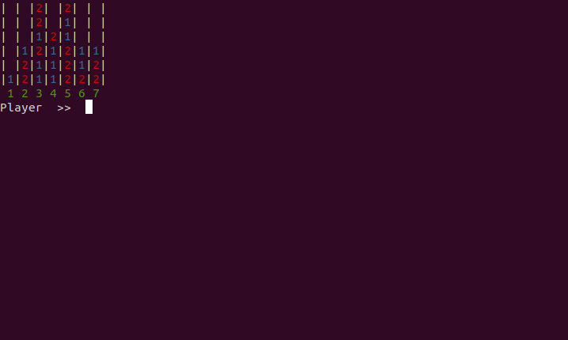

# Connect Four (Learning AI)

This is my second project that I made after I decided to start learning AI. It is a simple AI playing the classic Connect Four game.
As you can see from the folders, right now there are three versions, version three of which is still a work in progress. Mainly
because I am still trying to figure out how to use the minimax algorithim. While versions 1 and 2 utilize loops to search through 
possible plays.

Here is screenshot:

